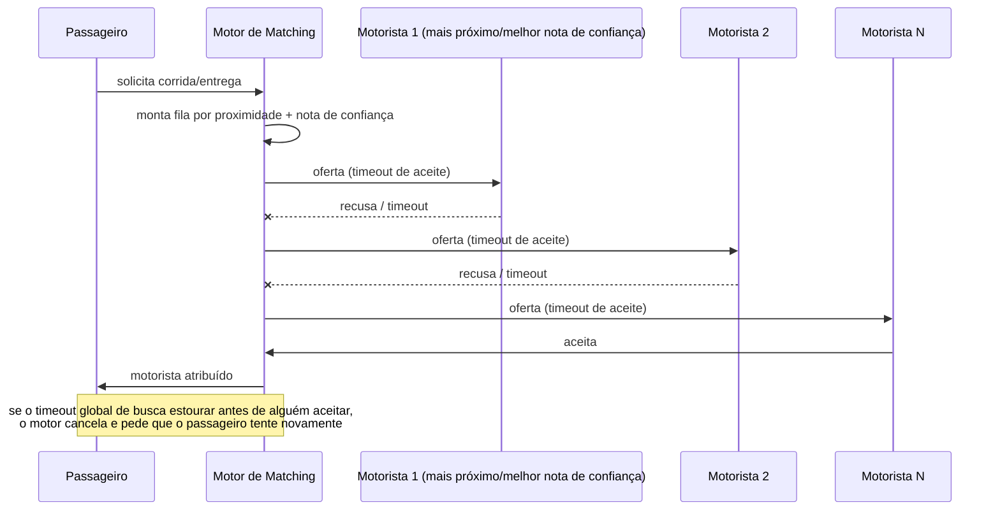
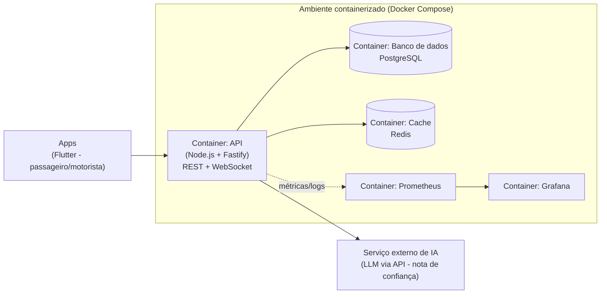

# UrbanoGo - Mobilidade Urbana (Caronas/Entregas)

Projeto da disciplina de pós-graduação em DevOps (UNIFOR) - Equipe 06.

### Equipe:
- João Victor Silva Almeida (2519093)
- Matheus Guimarães de Paula (2518306)
- Tiago da Silva Nascimento (2519090)
- Victor Kauan Lima de Oliveira (2518877)

---

## 1. Contexto do negócio

O UrbanoGo é um aplicativo de mobilidade urbana que conecta motoristas parceiros a
passageiros e a pequenas entregas dentro da cidade, usando geolocalização em tempo
real. O sistema precisa casar motorista e passageiro (matching) e calcular o preço
da corrida dinamicamente, reagindo em segundos a mudanças de demanda (chuva, hora do
rush), já que decisões lentas custam clientes.

**Exemplo do dia a dia:** Roberto quer enviar um presente de aniversário para a mãe
dele, que mora do outro lado da cidade, mas está sem tempo para levar pessoalmente.
Ele abre o UrbanoGo, informa o endereço de coleta e de entrega, e em poucos segundos
o app encontra um motorista bem avaliado e disponível perto dele. Roberto acompanha
a entrega em tempo real no mapa e recebe uma notificação assim que o presente chega
na casa da mãe - tudo isso mesmo em um dia chuvoso de sexta à noite, quando a demanda
por entregas está alta.

## 2. Escopo

- Solicitação de corrida (carona) ou entrega pelo passageiro.
- Motorista define sua preferência de atendimento (carona e/ou entrega).
- Matching motorista-passageiro por proximidade e rating.
- Sistema de avaliação (rating) mútuo entre motorista e passageiro pós-corrida, com nota de confiança calculada por IA a partir do histórico e dos comentários.
- Rastreamento em tempo real da corrida no mapa.
- Cálculo de preço dinâmico conforme distância, horário, demanda e clima.

**Restrição especial:** matching e precificação são caminho crítico de baixa
latência - o sistema precisa responder em segundos a picos de demanda, e picos
diários são muito marcados (rush, noites de fim de semana, dias de chuva).

## 3. SLA desejado

| Métrica | Meta | Observação |
|---|---|---|
| Disponibilidade | 99,9% | ≈ 43min de downtime tolerado/mês (error budget) |
| Tempo de resposta do matching | < 3s | ponta a ponta, do pedido até motorista atribuído |
| Latência de atualização de posição no mapa | < 5s | percebida pelo passageiro durante a corrida |

Esse SLA é o que orienta as decisões de arquitetura abaixo: tudo que está no
caminho do matching/precificação precisa ser assíncrono, cacheado e escalável
horizontalmente para absorver picos sem degradar a resposta.

## 4. Stack proposta

Stack já definida pela equipe - simples de propósito, para caber no orçamento de
4 semanas / 4 pessoas / 7h por semana cada.

| Camada | Tecnologia | Por quê |
|---|---|---|
| Apps (passageiro/motorista) | Flutter, um único projeto com **flavors** (`passageiro` / `motorista`) | 1 codebase, 2 builds/públicos distintos, sem duplicar UI |
| Backend / API | Node.js + **Fastify** - API única | leve e rápida; um único serviço é suficiente para a equipe e o prazo (sem separar em microsserviços agora) |
| Tempo real | WebSocket / Socket.IO | posição do motorista, status da corrida e ofertas de matching sem polling |
| Banco de dados | **PostgreSQL** | dados relacionais (usuários, corridas, avaliações); proximidade calculada com lat/lng indexados + fórmula de distância em SQL - sem extensão geoespacial por ora |
| Cache / estado efêmero | Redis | posição atual dos motoristas, fila de candidatos do matching, sinal de demanda por região |
| Containerização | Docker + Docker Compose | ambiente igual para os 4 devs e para o CI |
| CI | **GitHub Actions** | lint + testes + build a cada PR (entrega 2) |
| Observabilidade | stack padrão: Prometheus + Grafana + logs estruturados (JSON) | entrega 3 |
| Hospedagem do MVP | 1 VM/cloud free tier | suficiente para demo, sem custo de infra elástica |
| Nota de confiança (IA) | LLM via API (ex.: Claude API) para análise de sentimento dos comentários | evita treinar modelo próprio no prazo do MVP; usa uma IA pronta para extrair sinal qualitativo das avaliações |

## 5. Motor de matching e precificação

**Preferência do motorista:** cada motorista define no perfil se atende
carona, entrega, ou ambos; o motor só o considera candidato para o tipo de
solicitação compatível.

**Rating (nota de confiança via IA):** motorista e passageiro se avaliam
mutuamente ao fim de cada corrida/entrega, com nota numérica e comentário
livre. Em vez de usar só a média numérica, uma IA (LLM via API) analisa o
histórico de corridas, notas e comentários para gerar uma **nota de
confiança** - captando sinais que uma média simples não pega (ex.: motorista
com nota alta no geral, mas comentários recentes indicando queda de
qualidade). Essa nota de confiança é o critério de ranqueamento usado no
matching (não só proximidade) - motoristas com nota de confiança baixa
perdem prioridade mesmo estando perto.

**Algoritmo de busca - proximidade + nota de confiança, via Chain of Responsibility:**
1. O motor monta uma fila de candidatos compatíveis (tipo de serviço), ordenada por uma combinação de distância e nota de confiança.
2. A oferta é enviada a um motorista por vez (elo da cadeia); cada elo tem um **timeout de aceite** (ex.: 15s).
3. Se recusar ou estourar o timeout, a oferta passa para o próximo da fila.
4. Se algum motorista aceitar, a corrida é atribuída e a busca termina.
5. Existe também um **timeout global de busca** (ex.: 60s): se a fila se esgotar ou o tempo total estourar sem aceite, a busca é cancelada e o passageiro é avisado para tentar novamente.

**Precificação:** preço = tarifa base + (distância × tarifa por km), ajustado
por multiplicadores de horário (pico/fora de pico), demanda (oferta de
motoristas disponíveis vs. pedidos na região) e clima (ex.: chuva), mais uma
taxa de serviço fixa.

## 6. Diagrama de arquitetura (visão macro)

Visão de alto nível, sem entrar nos módulos internos do motor de matching
(detalhado na seção 5) - só os grandes blocos e suas tecnologias.

## 7. Mapa de importância das disciplinas para este projeto

Classificação da equipe para as 19 disciplinas do curso, à luz do contexto do
UrbanoGo (latência crítica no matching, picos de demanda marcados, SLA de
99,9%, 2 públicos de app, dados sensíveis de localização/pagamento):

| Disciplina | Prioridade |
|---|---|
| Direito Digital e LGPD | 🔴 Muito importante |
| Fundamentos de Engenharia de Software | 🔴 Muito importante |
| Desenvolvimento de Software Integrado – DevOps | 🔴 Muito importante |
| Design da Experiência do Usuário | 🔴 Muito importante |
| Desenvolvimento de Software Seguro – DevSecOps | 🔴 Muito importante |
| Arquitetura de Microsserviços e Escalabilidade | 🔴 Muito importante |
| Documentação Técnica | 🔴 Muito importante |
| Computação em Nuvem | 🔴 Muito importante |
| Integração e Entrega Contínua | 🔴 Muito importante |
| Orquestração de Contêineres e Gerenciamento de Cluster | 🔴 Muito importante |
| Controle de Versão e Gerenciamento de Configuração | 🟠 Importante |
| Infraestrutura Automatizada | 🟠 Importante |
| Testes Automatizados e Contínuos | 🟠 Importante |
| Monitoramento e Análise de Logs | 🟠 Importante |
| Ecossistemas de Startups | 🟡 Médio |
| Metodologias Ágeis em Gestão de Projetos | 🟡 Médio |
| Gerenciamento de Produtos | 🟡 Médio |
| Tópicos Avançados em Engenharia de Software | 🟡 Médio |
| Computação sem Servidores | ⚪ Pouco importante |

## 8. Plano de desenvolvimento (cronograma das entregas)

| # | Entrega | Data | Escopo |
|---|---|---|---|
| 1 | Planejamento | 29/08/2026 | Contexto, SLA, stack, diagrama, disciplinas críticas, plano de desenvolvimento (este documento) |
| 2 | CI/MVP (frontend e backend) | 10/09/2026 | Repositório com CI (lint, build, testes) + MVP mínimo navegável de front e back |
| 3 | Observabilidade | 11/09/2026 | Métricas (Prometheus/Grafana), logs estruturados, dashboards e alertas básicos |
| 4 | Plano de teste e de escala | 12/09/2026 | Estratégia de testes automatizados + plano de carga/escala para os picos de demanda |

Depois dessas 4 entregas do curso, a visão de continuidade do produto para os
próximos 3 meses está detalhada na seção 9.

## 9. Funcionalidades e melhorias para os próximos 3 meses

| Mês | Entrega | Escopo |
|---|---|---|
| Mês 1 | Pagamento e histórico | Pagamento dentro do app (cartão e Pix), histórico de corridas/entregas com recibo, endereços favoritos (casa, trabalho) pra pedir uma corrida em poucos toques |
| Mês 2 | Confiança e comunicação | Verificação de identidade do motorista (documento + selfie), chat dentro do app entre motorista e passageiro, nota de confiança (IA) mais completa considerando também pontualidade e regularidade |
| Mês 3 | Crescimento | Corrida compartilhada (dois passageiros no mesmo trajeto dividem o custo), programa de indicação (indique um amigo e ganhe desconto), pequenos ajustes de infraestrutura para aguentar mais usuários e talvez uma nova cidade |
