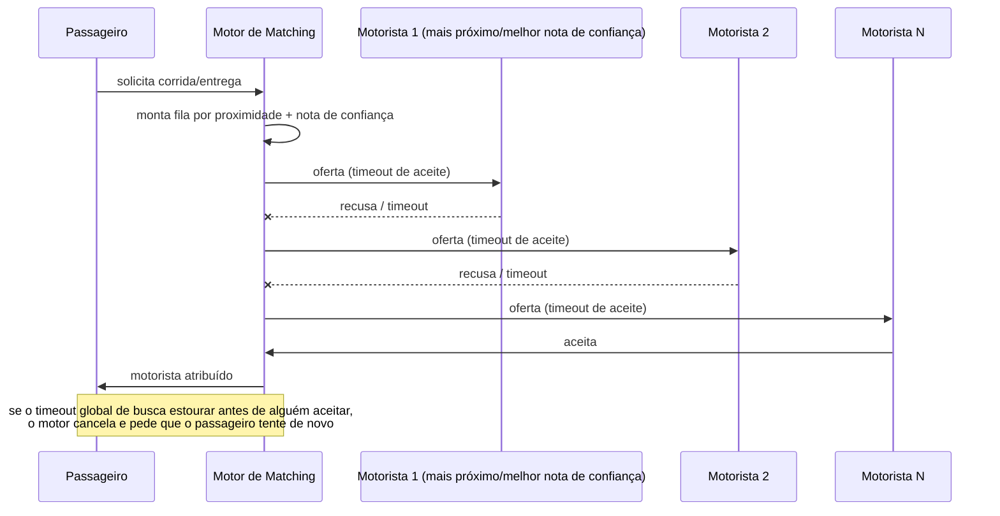
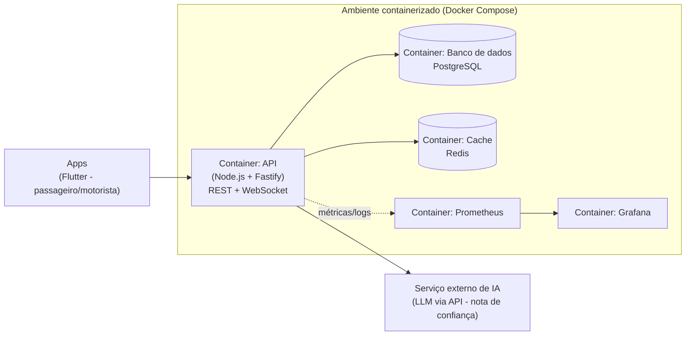

# Arquitetura

## Stack

Stack definida pela equipe, simples de propósito, para caber no orçamento de
4 semanas, 4 pessoas, 7h por semana cada. As decisões de stack e convenções do
backend estão detalhadas em [adr/0001-stack.md](adr/0001-stack.md).

| Camada | Tecnologia | Por quê |
|---|---|---|
| Apps (passageiro/motorista) | Flutter, um único projeto com **flavors** (`passageiro` / `motorista`) | 1 codebase, 2 builds e públicos distintos, sem duplicar UI |
| Backend / API | Node.js + **Fastify**, API única | leve e rápida; um serviço só é suficiente para a equipe e o prazo (sem microsserviços agora) |
| Tempo real | WebSocket / Socket.IO | posição do motorista, status da corrida e ofertas de matching sem polling |
| Banco de dados | **PostgreSQL** | dados relacionais (usuários, corridas, avaliações); proximidade com lat/lng indexados e fórmula de distância em SQL, sem extensão geoespacial por ora |
| Cache / estado efêmero | Redis | posição atual dos motoristas, fila de candidatos do matching, sinal de demanda por região |
| Mapa e rotas | `flutter_map` + tiles OSM; OSRM para snap-to-road | sem chave de API, sem custo |
| Clima | Open-Meteo | sem chave de API |
| Containerização | Docker + Docker Compose | ambiente igual para os 4 devs e para o CI |
| CI | **GitHub Actions** | lint, testes e build a cada PR (entrega 2) |
| Observabilidade | Prometheus + Grafana + logs estruturados (JSON) | entrega 3 |
| Hospedagem do MVP | VPS Hostinger | suficiente para a demo, sem custo de infra elástica |
| Nota de confiança (IA) | LLM via API (**DeepInfra**, compatível com OpenAI) para análise dos comentários | evita treinar modelo próprio no prazo; extrai sinal qualitativo das avaliações |

## Motor de matching e precificação

**Preferência do motorista:** cada motorista define no perfil se atende carona,
entrega, ou ambos; o motor só o considera candidato para o tipo de solicitação
compatível.

**Nota de confiança via IA:** motorista e passageiro se avaliam mutuamente ao fim
de cada corrida ou entrega, com nota numérica e comentário livre. Em vez de usar
só a média numérica, uma IA (LLM via API) analisa o histórico de corridas, notas e
comentários para gerar uma **nota de confiança**, captando sinais que uma média
simples não pega (ex.: motorista com nota alta no geral, mas comentários recentes
indicando queda de qualidade). Essa nota de confiança é o critério de ranqueamento
usado no matching, não só a proximidade: motoristas com nota de confiança baixa
perdem prioridade mesmo estando perto.

**Algoritmo de busca (proximidade + nota de confiança, via Chain of Responsibility):**

1. O motor monta uma fila de candidatos compatíveis (tipo de serviço), ordenada por
   uma combinação de distância e nota de confiança.
2. A oferta é enviada a um motorista por vez (elo da cadeia); cada elo tem um
   **timeout de aceite** de 15s.
3. Se recusar ou estourar o timeout, a oferta passa para o próximo da fila.
4. Se algum motorista aceitar, a corrida é atribuída e a busca termina.
5. Existe também um **timeout global de busca** de 60s: se a fila se esgotar ou o
   tempo total estourar sem aceite, a busca é cancelada e o passageiro é avisado
   para tentar de novo.

**Precificação:** preço = tarifa base + (distância x tarifa por km), ajustado por
multiplicadores de horário (pico ou fora de pico), demanda (oferta de motoristas
disponíveis vs. pedidos na região) e clima (ex.: chuva), mais uma taxa de serviço
fixa.

## Visão macro

Alto nível, sem entrar nos módulos internos do motor de matching, só os grandes
blocos e suas tecnologias.

