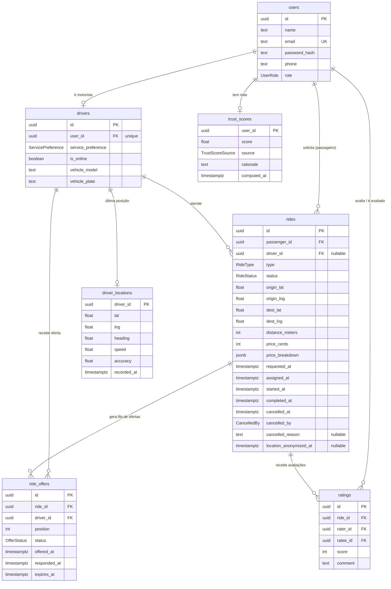

# Modelo de dados

Backend em PostgreSQL via Prisma. Convenções em [ADR 0011 - UUID v7](adr/0011-uuid-v7-como-identificador.md) e [ADR 0012 - timestamptz UTC](adr/0012-timestamptz-utc-para-datas.md):
IDs em UUID v7 (`@default(uuid(7))`, gerado no cliente), datas em `timestamptz` (UTC),
tabelas e colunas em `snake_case`.

## Diagrama

## Tabelas

### users

Conta de qualquer pessoa no sistema. `role` (`passenger` | `driver` | `both`) diz o
que a pessoa pode fazer. `email` é único.

### drivers

Perfil específico de motorista, 1:1 com `users` (`user_id` único).
`service_preference` (`rides` | `deliveries` | `both`) é a preferência de atendimento:
o motor de matching só considera o motorista para o tipo de solicitação compatível.
`is_online` é persistido aqui; o estado ao vivo para o matching fica no Redis.

### rides

Uma corrida ou entrega. `status`: `requested` -> `searching` -> `assigned` ->
`in_progress` -> `completed`, mais `cancelled` e `expired`. Origem e destino em
`lat` / `lng` (mais endereço textual opcional). Valores monetários em centavos
(`price_cents`); `price_breakdown` guarda a composição do preço (base, por km,
multiplicadores, taxa). `driver_id` é nulo até a atribuição e referencia `drivers`.
Marcos de tempo (`assigned_at`, `started_at`, etc.) para métricas e histórico.
`location_anonymized_at` marca quando a varredura de retenção (SEC-4) arredondou
as coordenadas e apagou os endereços; ver `docs/lgpd.md`.

### ride_offers

Log da Chain of Responsibility do matching: uma linha por oferta feita a um motorista.
`position` é a ordem na fila, `expires_at` é o limite do timeout de aceite (15s),
`status` (`pending` | `accepted` | `rejected` | `timed_out` | `cancelled`).
Único por `(ride_id, driver_id)`: um motorista recebe no máximo uma oferta por corrida.

### driver_locations

Última posição conhecida de cada motorista (uma linha por motorista, feita upsert).
`heading` e `speed` alimentam a predição de trajeto do rastreamento em tempo real.
Índice em `(lat, lng)` para a busca de proximidade (haversine em SQL). O histórico
completo de posições fica de fora desta tabela; será uma tabela separada quando o
expurgo por retenção (SEC-4) for implementado.

### ratings

Avaliação de uma ponta sobre a outra ao fim de uma corrida. `score` de 1 a 5,
`comment` livre. Único por `(ride_id, rater_id)`: cada parte avalia uma vez por
corrida. Índice em `ratee_id` para montar o histórico de quem é avaliado.

### trust_scores

Nota de confiança consolidada por usuário (1:1 com `users`). `score` de 0 a 1.
`source` (`stub` | `llm`) indica se veio da média ponderada simples ou da análise
por LLM; `rationale` guarda a justificativa quando vem do LLM. `computed_at` marca
o último cálculo.

## Colunas de auditoria

Padrão de trilha de auditoria completa em `users`, `drivers`, `rides` e `ratings`:

| Coluna | Tipo | Descrição |
|---|---|---|
| `created_at` | `timestamptz` | preenchida na criação |
| `updated_at` | `timestamptz` | atualizada em toda escrita |
| `deleted_at` | `timestamptz` nulo | soft delete; nulo enquanto o registro está ativo |
| `created_by_id` | `uuid` nulo | quem criou |
| `updated_by_id` | `uuid` nulo | quem alterou por último |
| `deleted_by_id` | `uuid` nulo | quem removeu |

As colunas `*_by_id` são `uuid` sem chave estrangeira nem navegação no Prisma, para
não multiplicar relações no model `User`; guardam apenas a referência.

`ride_offers`, `driver_locations` e `trust_scores` têm só `created_at` e
`updated_at`: são geradas pelo sistema (sem ator humano) e não têm soft delete
(a posição é tratada pela retenção da SEC-4; a oferta tem seu próprio ciclo de
`status`).

## Convenções de uso

- **Soft delete**: toda leitura em tabela com `deleted_at` deve filtrar
  `deleted_at IS NULL`. Um helper ou extensão do Prisma vai centralizar isso.

## Pendências conhecidas

- Índices únicos parciais (`WHERE deleted_at IS NULL`) em `users.email`,
  `drivers.user_id` e `ratings (ride_id, rater_id)` para não bloquear reuso após
  soft delete. Ficaram de fora desta migration para não gerar drift com o schema
  do Prisma; entram via SQL manual depois.
- Check constraints no banco para `ratings.score` (1 a 5) e `trust_scores.score`
  (0 a 1). Por ora a faixa é validada na camada de aplicação (Zod).

## Revisão

- Campos de corrida e matching (`rides`, `ride_offers`): VK.
- Campos de posição (`driver_locations`): Tiago.
