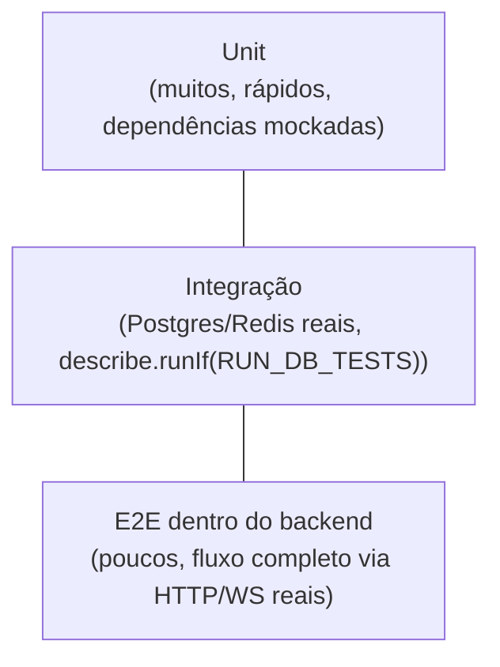

# Plano de testes

Documento vivo (TST-4). Descreve a pirâmide de testes do backend, o que cada
nível significa neste repositório, a cobertura atual e o que roda no CI. Os
detalhes de como subir a infraestrutura de teste localmente (Testcontainers,
`RUN_DB_TESTS`) já estão em [setup.md](setup.md#testes-de-integração-run_db_tests) —
este documento não repete isso, só referencia.

## Pirâmide

Hoje: **36 arquivos de teste, 200 testes**. Rodam em ~15-30s localmente com
Docker disponível.

## O que é cada nível aqui

Neste repo o nível **não é decidido pelo nome do arquivo** (`*.test.ts` vs
`*.integration.test.ts` é só uma convenção solta, nem sempre seguida), e sim
por como o teste declara sua necessidade de infraestrutura real:

* **Unit** — sem `describe.runIf(RUN_DB_TESTS)`. Dependências externas
  (Prisma, Redis, Socket.IO, `fetch`) são mockadas (`vi.spyOn`) ou trocadas
  por fakes simples passados via injeção de dependência (ex.:
  `MatchingEngineDeps.scheduler`, `QuoteDeps.resolveWeather`). Rodam sem
  Docker, em milissegundos. Cobrem: regras de negócio puras (state machine da
  corrida, precificação, ranking de candidatos, projeção de posição por dead
  reckoning), serializers, e o roteamento HTTP/WS com as dependências de
  infra dubladas.
* **Integração** — `describe.runIf(process.env.RUN_DB_TESTS === "1")`.
  Batem em Postgres e Redis de verdade: localmente via Testcontainers
  (globalSetup do Vitest, URB-31), no CI via `services:` do GitHub Actions.
  Cobrem rotas REST completas (auth, rides, offers, ratings, quotes, users,
  drivers), o motor de matching de ponta a ponta, e a ingestão de posição e
  sinal de demanda no Redis.
* **E2E** — `rides/ride-flow.e2e.test.ts` (TST-3) é o cenário único que percorre
  o caminho principal só via `app.inject()`: cadastro → motorista online →
  solicitação → matching → oferta → aceite → chegada → início → conclusão →
  avaliação mútua → nota de confiança. `socket.test.ts` complementa com um
  cliente Socket.IO real contra um servidor real (porta efêmera, não
  `inject()`), e os testes de integração de `rides`/`offers`/`matching`
  cobrem os ramos alternativos do mesmo fluxo. Isso cobre "ponta a ponta
  dentro do backend". **Não cobre** o app Flutter: é um repositório separado,
  ainda em estágio inicial (Matheus), e testar os dois juntos entra quando o
  app integrar com a API de verdade — não faz sentido antes disso.

## Cobertura

Sem gate de CI por enquanto (rodar `npm run test:coverage` é manual). Linha
de base, medida com Docker/`RUN_DB_TESTS` ligado, em 2026-09-10:

| Área | Cobertura (linhas) | Observação |
|---|---|---|
| Geral | **89,1%** | plumbing novo (`src/jobs`, plugin de retenção) puxa pra baixo; regras de negócio seguem acima da meta |
| `src/modules/trust-score` | 96,3% | reforçado no URB-54: `trust-score.service.ts` agora cobre score válido da LLM, clamp, resposta sem conteúdo, score não numérico, exceção (timeout) e histórico vazio |
| Regras críticas (pricing, state machine da corrida, proximidade) | 87-100% | matriz de transição completa; proximidade tem teste unitário das guardas de entrada além do de integração |
| `src/jobs`, `src/plugins/location-retention.ts` | baixo | job de retenção coberto pelas rotinas em `src/modules/privacy` (integração); o wiring por `setInterval` não tem teste dedicado |

**Meta**: manter **80%+ de linhas** nas regras de negócio (`src/modules/**`,
excluindo rotas/serializers triviais) e não deixar cair abaixo disso sem
justificativa no PR. Não é um número perseguido por si só — 100% em getter
trivial não vale o esforço, mas caminho de erro de motor de matching,
precificação e state machine da corrida vale.

## Testes de contrato entre app e API

[`contrato-api.md`](contrato-api.md) é a fonte da verdade e "congela" depois
do fim do dia 1 do planejamento (ADR 0004) — qualquer mudança passa por lá e
avisa o time, especificamente o Matheus (app).

O que já garante alinhamento automaticamente:

* Toda rota valida o payload com **Zod** (`fastify-type-provider-zod`); um
  payload fora do formato documentado recebe `422` com o detalhe do campo,
  não passa silenciosamente.
* O envelope de resposta (`{ status_code, message, data }`) é decorado uma
  vez (`responsePlugin`) e usado em toda rota — não tem como uma rota nova
  "esquecer" o formato.
* Os testes de integração de cada módulo já verificam a forma da resposta
  (`serializeRide`, `serializeUser` etc.) bate com o que o contrato promete.

O que **não existe ainda**: um teste de contrato automatizado entre este
repo e o do app Flutter (nada como Pact ou um schema OpenAPI compartilhado
gerado a partir do Zod e consumido pelo outro lado). Hoje a garantia é o
documento + a validação Zod de um lado só. Isso é uma lacuna conhecida, não
um problema urgente enquanto o app ainda mocka o contrato (regra do
planejamento: "o app nunca fica bloqueado") — vale revisitar quando o app
começar a integrar de verdade contra a API.

## O que roda no CI

[`.github/workflows/ci.yml`](../.github/workflows/ci.yml), a cada push em
`main`/`develop` e a cada PR:

1. `npm ci`
2. `npm run lint` (ESLint + Prettier, check)
3. `npm run build` (`tsc`, sem emitir se der erro de tipo)
4. `npx prisma migrate deploy` contra o Postgres do `services:`
5. `npm test` — os 31 arquivos, unit e integração juntos; `RUN_DB_TESTS=1` e
   `DATABASE_URL`/`REDIS_URL` já apontam pros `services:` (Postgres e Redis
   efêmeros do próprio job), então nenhum teste de integração fica pulado

Cobertura **não** roda no CI hoje (`test:coverage` é manual, sem threshold
que quebre o build). Adicionar isso é uma decisão de time — precisa de
número de meta acordado e vontade de bloquear PR por causa disso, não é algo
pra decidir sozinho neste documento.
